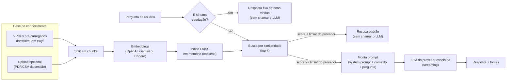

# Assistente BimBam Buy — ONE Oracle Alura Challenge Agente


|  |
|:---:|
| Agente de IA com RAG (Retrieval-Augmented Generation) que responde, em linguagem natural, dúvidas sobre as políticas da **BimBam Buy** — um e-commerce fictício —, com base exclusivamente nos documentos internos da empresa (pagamento, garantia, envio,devoluções e programa de afiliados). Projeto desenvolvido para o **Challenge Alura Agente**, do programa [Oracle Next Education (ONE)](docs/descricao_curso.md). |
| <div align="center"> <a href="https://cursos.alura.com.br/user/claudiomendonca" target="_blank">  </a> </div> |


> Entendimento completo do desafio, das decisões de projeto e do raciocínio por trás de
> cada escolha técnica: [docs/estudo_de_caso.md](docs/estudo_de_caso.md) e
> [docs/challenge_alura_agente.md](docs/challenge_alura_agente.md).

## O problema

Colaboradores perdem tempo procurando informações em manuais e políticas internas. A
BimBam Buy tem 5 documentos em PDF cobrindo pagamento, garantia, envio, afiliados e
reembolsos — e várias perguntas reais só fazem sentido cruzando mais de um desses
documentos (ex.: um defeito de fabricação passa primeiro pela garantia, só vai para
devolução se a garantia não cobrir). O agente existe para responder essas perguntas
diretamente, sem que ninguém precise abrir um PDF.

## Arquitetura



Tudo roda **em memória, por sessão do navegador** — não há banco de dados. Reiniciar o
app só custa reprocessar os 5 PDFs pré-carregados (rápido). A chave de API do usuário
fica só em `st.session_state`, nunca é salva em arquivo, banco ou log. Cada sessão pode
ter várias conversas em paralelo (barra lateral, ao estilo ChatGPT) — todas somem ao
fechar a aba, junto com o resto do estado da sessão.

O guardrail principal não é o prompt — é a camada de recuperação: se a melhor
similaridade encontrada no índice ficar abaixo de um limiar mínimo, o agente recusa a
pergunta **sem sequer chamar o LLM**, o que evita que o modelo "invente" uma resposta de
conhecimento geral para perguntas fora do escopo da BimBam Buy. O system prompt reforça
essa regra em toda chamada e trata qualquer texto do usuário (ou dos documentos) como
dado, nunca como instrução — mitigação contra tentativas de prompt injection / jailbreak.
Detalhes completos das ameaças consideradas e dos testes de "red team" planejados estão
em [docs/estudo_de_caso.md](docs/estudo_de_caso.md#segurança-e-guardrails-do-agente).

**O limiar de similaridade é calibrado por provedor, não é um número universal.** Cada
modelo de embedding tem uma faixa de score de cosseno diferente para o mesmo par
pergunta/documento — testado com a Cohere (`embed-v4.0`) em perguntas reais sobre os 5
documentos, perguntas no escopo pontuaram entre -0,23 e 0,36, enquanto perguntas fora do
escopo ficaram abaixo de -0,45, então seu limiar é -0,3. OpenAI e Google Gemini tendem a
manter scores positivos e mais altos para bons matches, com limiar de 0,5. Erros do
provedor (chave inválida, limite de uso, falha de rede) também viram uma mensagem em
português para leigos em vez do erro técnico bruto, com os detalhes originais disponíveis
num expander para quem quiser depurar.

### Estrutura do código

```
app.py                      # interface Streamlit (chat multi-conversa + modal de config.)
src/
  config.py                 # system prompt, recusa, saudação, sugestões, limiares, provedores
  document_loader.py        # extração de texto (PDF/CSV) e chunking
  llm_providers.py          # fábricas de embeddings/chat model (OpenAI / Gemini / Cohere)
  knowledge_base.py         # índice FAISS em memória (build / add / remove)
  rag_agent.py              # guardrail de similaridade + streaming + sugestões de acompanhamento
docs/BimBam Buy/            # base de conhecimento pré-carregada (5 PDFs)
```

## Tecnologias utilizadas

- **Python 3.11**
- **Streamlit** — interface de chat e modal de configuração (`st.dialog`)
- **LangChain** (`langchain`, `langchain-community`, `langchain-openai`,
  `langchain-google-genai`, `langchain-cohere`) — orquestração do RAG
- **FAISS** (`faiss-cpu`) — índice vetorial em memória
- **pypdf** e **pandas** — leitura de PDF e CSV
- **OpenAI**, **Google Gemini** ou **Cohere** — modelo de linguagem e de embeddings, à
  escolha do usuário (chave própria, informada em tempo de uso — nunca fica no código)
- **Dev Container** (VS Code) — ambiente de desenvolvimento reprodutível

## Como executar

Pré-requisito: uma chave de API da **OpenAI**, do **Google AI Studio (Gemini)** ou da
**Cohere** — gratuita para testes na maioria dos provedores.

```bash
pip install -r requirements.txt
streamlit run app.py
```

O app abre em `http://localhost:8501`. Ao abrir, clique no ícone de configurações (⚙️) no
topo, escolha o provedor, cole sua chave de API e clique em **Salvar** — os 5 documentos
da BimBam Buy são indexados automaticamente nesse momento. Não sabe onde conseguir a
chave? O ícone de ajuda ao lado do campo abre um passo a passo com link direto para a
página de chaves do provedor escolhido (abre em nova aba). Depois é só perguntar no chat
(a resposta chega em streaming, palavra por palavra) ou clicar em uma das sugestões de
pergunta exibidas acima do campo de texto — elas mudam a cada resposta, priorizando
perguntas relacionadas ao que acabou de ser perguntado. Depois que a base é criada, o
provedor fica travado na sessão; para trocar, use **Desconectar para trocar de provedor**
no mesmo modal de configurações. Opcionalmente, na mesma janela, é possível anexar PDFs
ou CSVs extras para a sessão (não são salvos em disco, somem ao fechar a aba).

A barra lateral guarda o histórico de conversas da sessão — dá para abrir quantas
conversas paralelas quiser ("Nova conversa"), alternar entre elas e excluir as que não
interessam mais. Nada disso é persistido: fechar a aba apaga tudo.

Se estiver usando o Dev Container do VS Code (`.devcontainer/`), as dependências já são
instaladas automaticamente e a porta 8501 já vem encaminhada.

## Exemplos de perguntas que o agente responde

Transcrições reais, geradas pelo agente rodando com a Cohere (`command-a-03-2025` +
`embed-v4.0`) sobre os 5 documentos da BimBam Buy — não são respostas de referência
escritas manualmente:

| Pergunta | Resposta do agente |
|---|---|
| Quais métodos de pagamento a BimBam Buy aceita? | A BimBam Buy aceita os seguintes métodos de pagamento, dependendo do país e da configuração operacional: Cartão de crédito, Cartão de débito, Transferência bancária / PIX, Pagamento em dinheiro em pontos habilitados (ex: Boleto), Carteiras digitais disponíveis por país. |
| Quanto tempo demora um reembolso? | O prazo habitual para um reembolso é de 5 a 10 dias úteis a partir da aprovação, dependendo do método de pagamento e do país de origem da compra. Em casos que exigem validação adicional, o prazo pode ser estendido, e o cliente será informado sobre o status do processo. |
| Quantos dias tenho para desistir de uma compra? | De acordo com a política de reembolsos e devoluções da BimBam Buy, você tem 10 dias corridos após o recebimento do pedido para solicitar a devolução por arrependimento de compra, desde que o produto esteja elegível para devolução. |
| O que faço se meu produto chegou danificado? | Relate o caso dentro de 48 horas após o recebimento (categoria "Produto danificado", seção 8.3). A equipe avalia com base em evidências (momento de detecção, tipo de dano, condição da embalagem, histórico de transporte); se suficiente, pode ser aplicada devolução, troca ou substituição sem esgotar o diagnóstico técnico. |
| A garantia cobre dano por queda do produto? | Não — de acordo com o Manual de Garantia, danos causados por golpes ou quedas estão na seção de exclusões e não são cobertos. |
| Meu produto quebrou sozinho depois de um mês de uso, o que eu faço? | Relate a falha com evidência clara (fotos/vídeo/descrição), não manipule o produto antes da revisão e mantenha-o em condições razoáveis até a inspeção. Se confirmado defeito de origem, a solução pode ser troca ou reparo, dependendo da disponibilidade (cruza Garantia + Reembolsos). |
| Se o cliente de um afiliado devolver o produto, o afiliado perde a comissão? | Sim, pode ser revertida ou ajustada: se um pedido indicado por um afiliado terminar em devolução ou reembolso, a comissão poderá ser ajustada conforme a política interna e a elegibilidade final da venda (cruza Afiliados + Reembolsos). |

Mais exemplos, incluindo perguntas fora de escopo que o agente deve recusar (ex.: "qual a
capital da França?") e tentativas de jailbreak, estão em
[docs/estudo_de_caso.md](docs/estudo_de_caso.md#exemplos-de-perguntas-que-o-agente-deve-responder).

## Status do projeto

- [x] Leitura e processamento dos documentos (PDF pré-carregados + upload opcional)
- [x] Agente de IA funcional com RAG e guardrails de segurança
- [x] Interface de chat local (Streamlit), com múltiplas conversas e histórico
- [x] Suporte a 3 provedores de LLM (OpenAI, Google Gemini, Cohere), com limiar de
      similaridade calibrado individualmente por provedor
- [x] Validação das respostas reais do agente com uma chave de API (tabela acima usa
      transcrições reais, não respostas de referência)
- [ ] Deploy na nuvem implementado no **Streamlit Cloud**
- [ ] Evidência do deploy (link ou captura de tela)

### Evidência de implantação

_Pendente — será adicionada aqui após o deploy._
